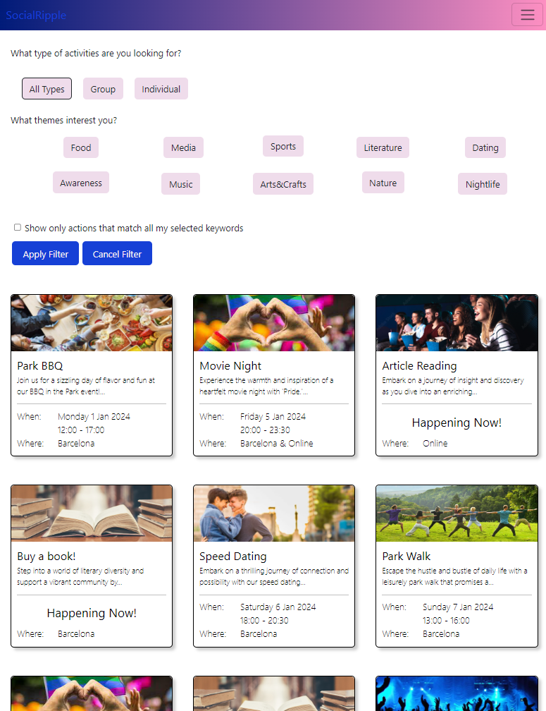
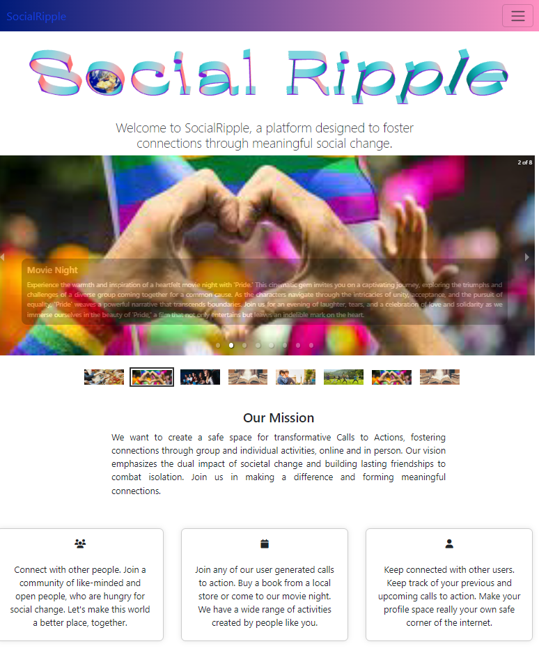

# Social Ripple

## Activism based social media

### App Overview

Social media promised to bring us together but these days it does just as much to drive us apart. We either covet or judge, and more often alone than together. Social Ripple aims to flip this trend, creating a platform for people to come together and take action for a better world.

Users create "Actions" for others to join, these can be individual such as reading a book about a particular social issue, or a group action such an meeting for a beach cleanup. Users join each others actions and connect through shared experience and interest.

Actions can be searched by keyword, and in person actions can be browsed on a map view.

&nbsp;&nbsp;&nbsp;&nbsp;&nbsp;&nbsp;&nbsp;&nbsp;&nbsp;&nbsp;&nbsp;&nbsp;

### Built with:

react
react-router
express
vite
node.js
sequelize
mysql
bcrypt
JWT
google maps api
bootstrap

### To set up a forked copy:

1. Clone the code and run "npm install" in both the main folder and the client folder.

2. Create your database in my sql and create your own .env file in the main folder including the following:

- DB_HOST=localhost
- DB_USER=your_sql_user_name
- DB_NAME=your_sql_database_name
- DB_PASS=your_sql_password
- SUPER_SECRET= a secret key for use by JWT (can be any simple string without spaces)

3. Once the database is created run "nmp run migrate && npm run seed" in the main folder.

4. Now you project is set up. Start your server by running "npm start" in your backend terminal and start your frontend by running "npm run dev" in the client folder.

5. You can now access the app on localhost
